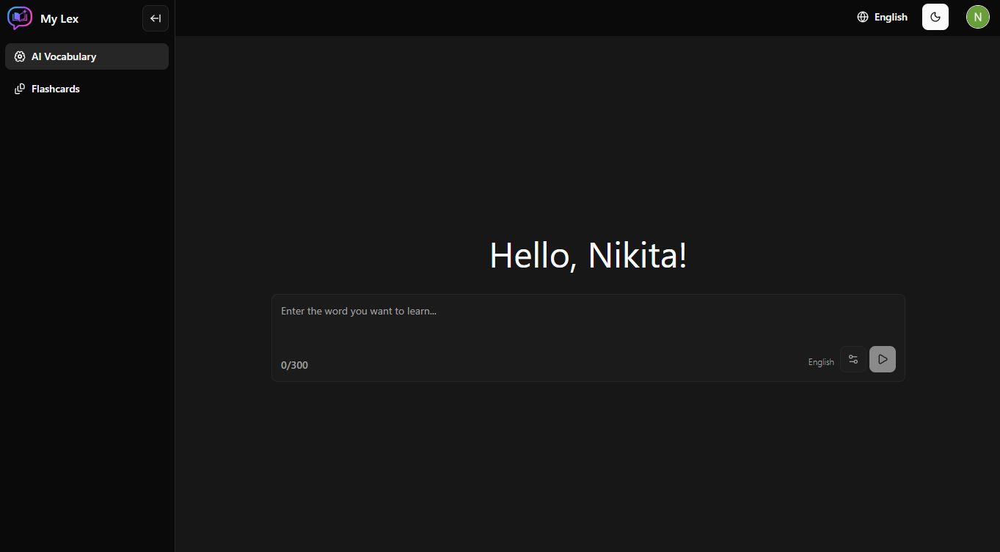
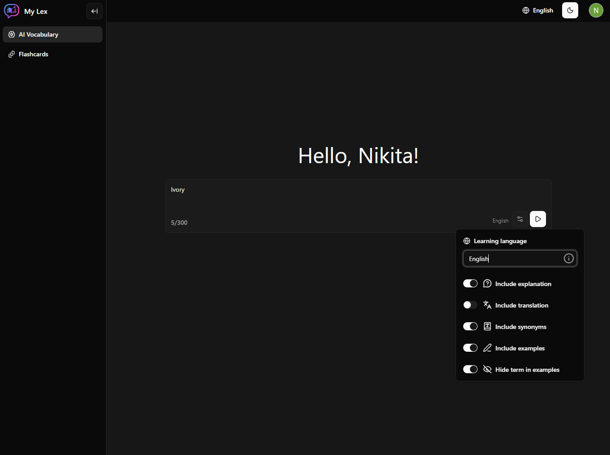
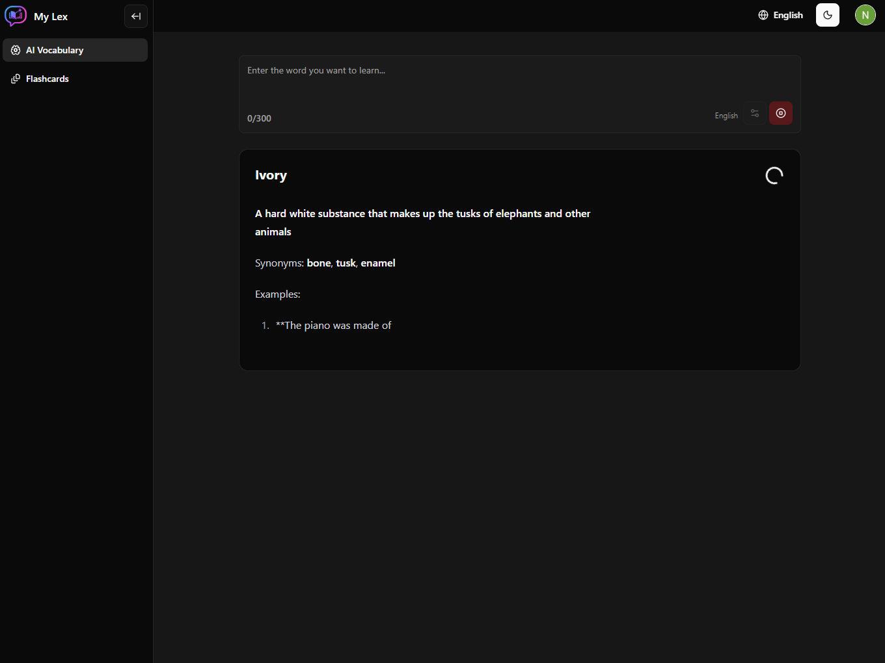
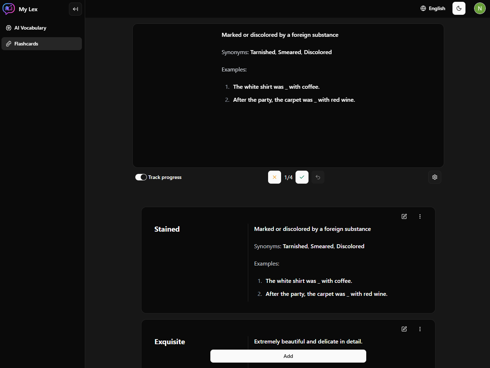
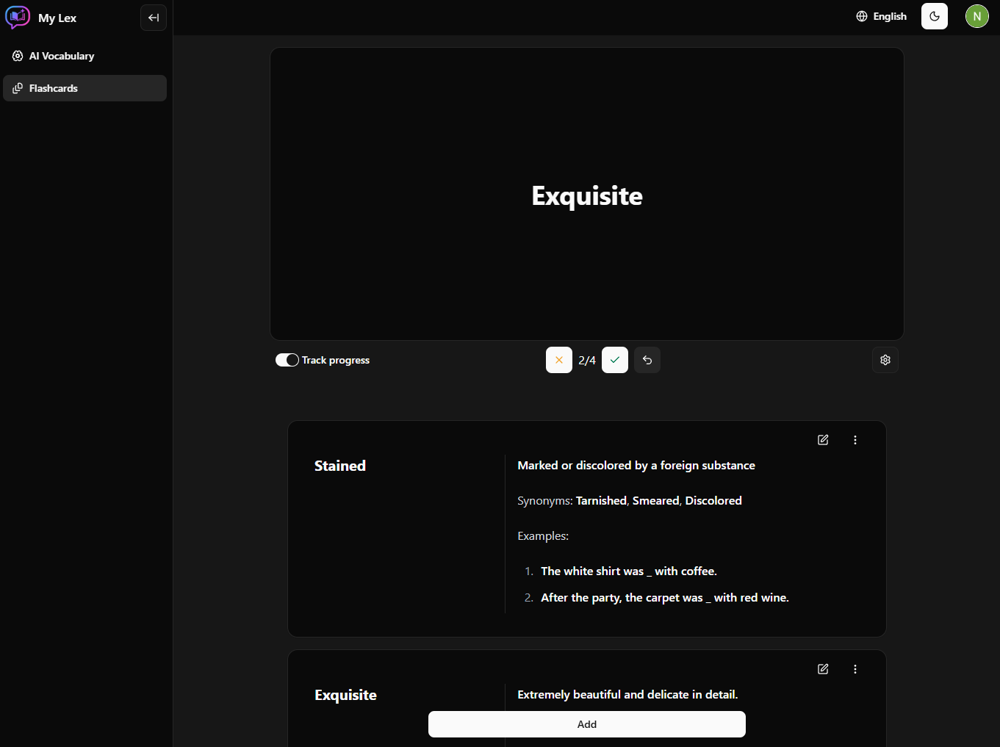
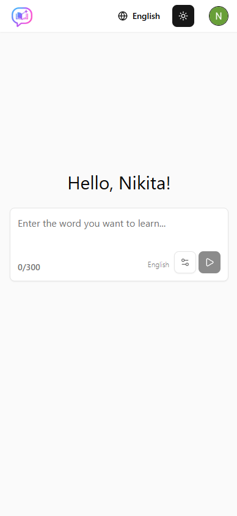
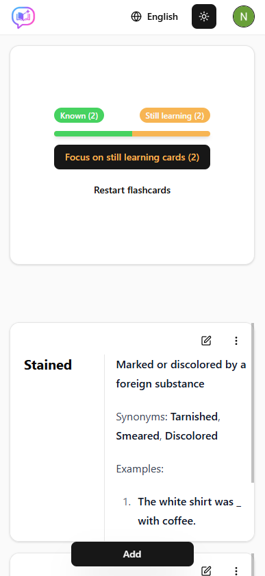
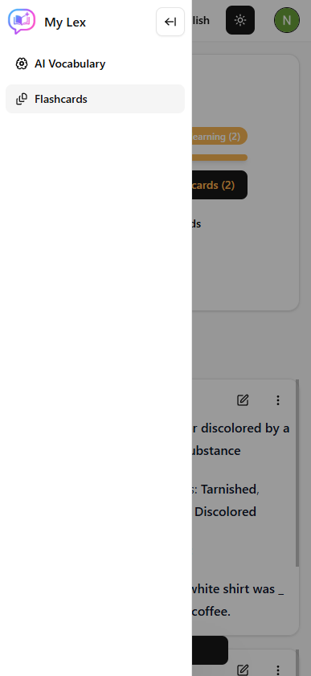

<h1 align="center">My Lex</h1>

<p align="center">
  
  <br>
  <em>My Lex is a platform for learning languages
    <br> using AI and flashcards.
  </em>
  <br>
</p>


<p align="center">
  
</p>

## Demo


Build and run the app locally with just a couple of commands:

```bash
cd docker-local-build-config
cp .env.template .env
docker compose -f docker-compose.local-build.yml up -d
```

## About the app

### Tech stack

It's an example of a fullstack application using:

- Next.js (frontend)
  - Tanstack React Query
  - Zustand
  - Context API + useReducer
  - Accessible **shadcn** components
- Nest.js (backend)
  - Prisma ORM
- NX
  - Effective monorepo management
  - Effective way to test, lint and build **only affected applications** and packages
- Postgres, Redis

### 💡 Tech highlights

**AI**

- **AI integration** with response streaming via **Server-Sent Events (SSE)**
  - easily extendable with new AI providers (e.g. Google or DeepSeek)
- Rate limiter for AI requests (10 free AI requests per day per user)

**Structure**

- **Shared models** and Zod schemas used by both frontend and backend

**Authentication & Security**

- OAuth (Google) + email authentication
  - easily extendable with additional OAuth providers
- Google reCAPTCHA
- API throttling to protect the application

**User Experience**

- Server-side rendering (SSR)
- Multi-language support
- Dark and light themes
- Animations ✨
- Rich markdown editor (for flashcards)
- Optimistic UI updates (instant UI updates with background revalidation)
- Mobile support

**DevOps & Quality**

- CI/CD
  - workflows for the master branch
  - workflows for pull requests
  - GitHub Container Registry for application images
- Tests
  - UI, API, e2e

## App overview

- The interface is simple, clean, and intuitive so there is no need for long or detailed instructions.

#### AI vocabulary

- Once you log in to My Lex you see the AI vocabulary.
<p align="center">
  
</p>

- Configure the AI vocabulary **settings** and **enter the word** you want to learn
<p align="center">
  
</p>

- Click the send button. The AI will send you the definition of the word.
<p align="center">
  
</p>

#### Flashcards

- Click the 'Flashcards' button in the sidebar to see your flashcards.
<p align="center">
  
</p>
- Here you can manage your flashcards or learn new words.
<p align="center">
  
</p>

#### 📱 Mobile version and light theme

- The app supports mobile devices and light theme

<p align="center">
  
  
  
</p>

## Development

1. Install the dependencies:

```bash
npm install
```

2. Run the databases

```bash
cp .env.dev-template .env
docker compose up -f docker-compose.dev.yml -d
```

3. Set up the environment variables

```bash
cp ./apps/api/.env.template ./apps/api/.env
cp ./apps/web/.env.template ./apps/web/.env
```

4. Initialize prisma and synchronize the database

```bash
npm run db-generate
npm run local-dev:db-push
```

4. Run API

```bash
npm run dev:api
```

5. Run web

```bash
npm run dev:web
```
